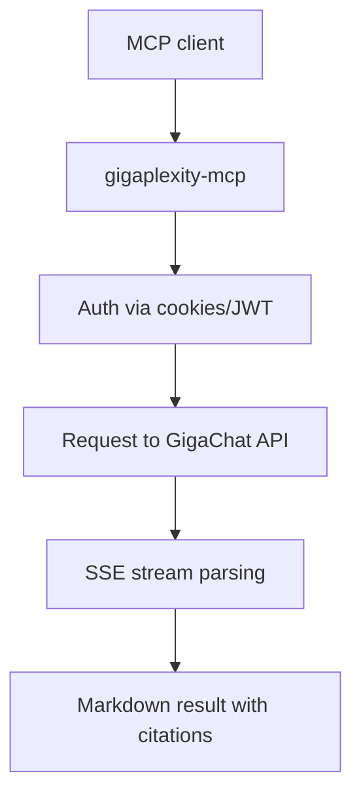

# 🔍 Gigaplexity MCP

[](https://opensource.org/licenses/MIT)
[](https://www.python.org/downloads/)

**Gigaplexity MCP** — MCP-сервер, который превращает GigaChat в поисковый инструмент: можно быстро получать ответы из интернета, запускать глубокие исследования и пошаговое рассуждение.

Работает в MCP-совместимых клиентах (например, VS Code Copilot, Claude Desktop и других).

> [!NOTE]
> Статус проекта: **Alpha**.

## Содержание

- [Возможности](#возможности)
- [Быстрый старт](#быстрый-старт)
- [Использование](#использование)
- [Вложения файлов](#вложения-файлов)
- [Переменные окружения](#переменные-окружения)
- [Локальная разработка](#локальная-разработка)
- [Для контрибьюторов](#для-контрибьюторов)
- [Как это работает](#как-это-работает)
- [Архитектура](#архитектура)
- [Отказ от ответственности](#отказ-от-ответственности)
- [Лицензия](#лицензия)

## Возможности

| Инструмент | Что делает | Примерная скорость |
|---|---|---|
| `ask` | Короткий ответ с веб-поиском и ссылками. Поддерживает вложения (документы, изображения, аудио). | ~20s |
| `research` | Глубокое многошаговое исследование по теме с развёрнутым отчётом. | ~45s |
| `reason` | Пошаговое рассуждение с опорой на веб-источники. | ~5s |

## Быстрый старт

### 1) Получите cookie GigaChat

Нужна **одна строка cookie** из браузера. Войдите в [giga.chat](https://giga.chat), откройте DevTools (`F12`) и выполните шаги:

1. Откройте вкладку **Network**.
2. Отправьте любое сообщение в чат.
3. Найдите запрос к `https://giga.chat/api/giga-back-web/api/v0/sessions/request`.
4. В **Headers** найдите заголовок `Cookie`.
5. Скопируйте **полное значение** (`_sm_sess=...; _sm_user_id=...; ...`).

<details>
<summary>Зачем полная строка cookie, а не только токен?</summary>

Токен `_sm_sess` обычно короткоживущий, а полная актуальная cookie-строка чаще работает стабильнее. 
`user_id` берётся автоматически из JWT, `project_id` — автоматически через profile API.

</details>

### 2) Добавьте сервер в конфиг MCP-клиента

```json
{
  "mcpServers": {
    "gigaplexity": {
      "command": "uvx",
      "args": [
        "--from",
        "git+https://github.com/alexsvdk/gigaplexity-mcp@stable",
        "gigaplexity-mcp"
      ],
      "env": {
        "GIGACHAT_COOKIES": "_sm_sess=eyJ...; _sm_user_id=2a4a...; sticky_cookie_dp=..."
      }
    }
  }
}
```

### 3) Задайте первый запрос

- «Найди последние изменения в Python 3.13» → `ask`
- «Что в этом PDF?» (с файлом) → `ask` + `file_paths`
- «Опиши это изображение» (с файлом) → `ask` + `file_paths`
- «Сделай исследование по time-series базам данных» → `research`
- «Пошагово объясни, почему трансформеры эффективны» → `reason`

## Использование

Инструменты сервера:

- `ask(query, file_paths?)`
- `research(query, domains?, extended?)`
- `reason(query)`

Если вы используете вложения, передавайте **абсолютные пути** к локальным файлам.

## Вложения файлов

`ask` поддерживает вложения через `file_paths`.

Поддерживаемые категории:

- **Документы**: `pdf`, `docx`, `doc`, `pptx`, `ppt`, `xlsx`, `xls`, `epub`, `txt`, `html` и файлы кода (`py`, `js`, `ts` и т.д.)
- **Изображения**: `jpg`, `jpeg`, `png`, `webp`, `heic`, `heif`, `bmp`
- **Аудио**: `mp3`, `aac`, `m4a`, `opus`, `wav`, `ogg`

> [!IMPORTANT]
> В одном запросе все файлы должны быть только **одной категории** (только документы / только изображения / только аудио).

## Переменные окружения

| Переменная | Обязательна | Описание |
|---|---|---|
| `GIGACHAT_COOKIES` | ✅* | Полная cookie-строка из DevTools |
| `GIGACHAT_SM_SESS` | ✅* | JWT-токен (альтернатива `GIGACHAT_COOKIES`) |
| `GIGACHAT_PROJECT_ID` | ❌ | UUID проекта (обычно подтягивается автоматически) |
| `GIGACHAT_USER_AGENT` | ❌ | `random` (по умолчанию), `random/<seed>` или фиксированный User-Agent |
| `GIGACHAT_BASE_URL` | ❌ | Базовый URL API (по умолчанию `https://giga.chat`) |
| `GIGACHAT_APP_VERSION` | ❌ | Версия приложения (по умолчанию `0.94.4`) |
| `GIGACHAT_LANGUAGE` | ❌ | Язык (по умолчанию `en`) |
| `GIGACHAT_TIMEZONE` | ❌ | Часовой пояс (по умолчанию `UTC`) |

\* Нужна либо `GIGACHAT_COOKIES` (рекомендуется), либо `GIGACHAT_SM_SESS`. Приоритет у `GIGACHAT_COOKIES`.

## Локальная разработка

```bash
git clone https://github.com/alexsvdk/gigaplexity-mcp
cd gigaplexity-mcp

python3 -m venv .venv
source .venv/bin/activate
pip install -e .
pip install pytest pytest-asyncio

# Юнит-тесты
pytest

# Интеграционные тесты (нужны валидные credentials)
export GIGACHAT_COOKIES="..."
pytest -m integration -s
```

## Для контрибьюторов

Если вы хотите помочь проекту, начните с этих документов:

- [CONTRIBUTING.md](CONTRIBUTING.md) — процесс вклада и требования к PR
- [SECURITY.md](SECURITY.md) — как безопасно сообщать об уязвимостях
- [CHANGELOG.md](CHANGELOG.md) — формат и история изменений
- [.github/pull_request_template.md](.github/pull_request_template.md) — шаблон Pull Request
- [.github/ISSUE_TEMPLATE/bug_report.md](.github/ISSUE_TEMPLATE/bug_report.md) — шаблон bug report
- [.github/ISSUE_TEMPLATE/feature_request.md](.github/ISSUE_TEMPLATE/feature_request.md) — шаблон feature request
- [.github/ISSUE_TEMPLATE/question.md](.github/ISSUE_TEMPLATE/question.md) — шаблон вопроса
- [docs/STYLEGUIDE.md](docs/STYLEGUIDE.md) — единые правила документации

## Как это работает



Базовый поток:

1. **Аутентификация** через cookie/токен браузерной сессии.
2. **Отправка запроса** в режим `ask`, `research` или `reason`.
3. **Парсинг SSE-стрима** и сбор полного ответа.
4. **Форматирование** в удобный markdown (включая ссылки на источники).

Используемые режимы моделей:

- **Ask**: `GigaChat-3-Ultra` + web search
- **Research**: `GigaChat-3-Ultra` + deep research agent
- **Reason**: `GigaChat-2-Reasoning` + chain-of-thought режим

## Архитектура

Подробности по протоколу и внутренним решениям: [ARCHITECTURE.md](ARCHITECTURE.md).

## Отказ от ответственности

> [!WARNING]
> Проект создан в **образовательных и исследовательских целях**. Используйте на свой риск.

1. **Личное использование**: проект ориентирован на private/local self-hosting.
2. **Риск блокировки**: неофициальная автоматизация может нарушать [условия сервиса GigaChat](https://giga.chat/legal/terms).
3. **Без гарантий**: ПО поставляется по лицензии MIT «как есть», без ответственности автора за последствия использования.

## Лицензия

[MIT](LICENSE)

---

_Для связи: пишите в телеграм [@a1ex5](https://t.me/a1ex5)._
